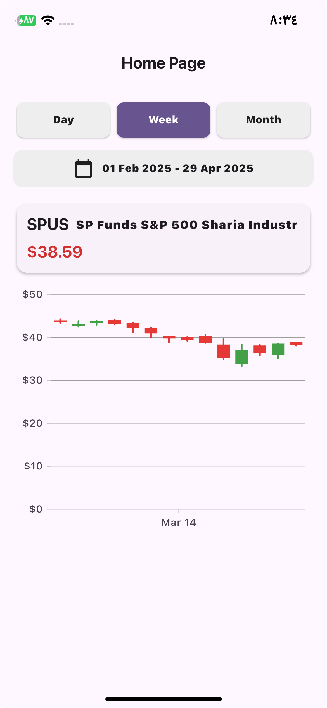

# SP Sharia Stock

A Flutter-based mobile application for tracking and analyzing Shariah-compliant stocks.



## Features

- Stock market data visualization with candlestick charts
- Shariah-compliant stock filtering and screening
- Real-time stock price updates
- Biometric authentication for secure access
- Date filtering and custom time periods
- Detailed stock information and analysis

## Technologies Used

- Flutter & Dart
- BLoC pattern for state management
- Dio for network requests
- Syncfusion Flutter Charts for data visualization
- Biometric authentication
- JSON serialization with Freezed

## Getting Started

### Prerequisites

- Flutter SDK (version ^3.7.2)
- Dart SDK
- Android Studio / Xcode

### Installation

1. Clone the repository:
   ```
   git clone https://github.com/Muhammad-Gamal2/sp_sharia_stock.git
   ```

2. Navigate to the project directory:
   ```
   cd sp_sharia_stock
   ```

3. Install dependencies:
   ```
   flutter pub get
   ```

4. Build files from code generation:
   ```
   flutter packages pub run build_runner build
   ```

5. Run the app:
   ```
   flutter run
   ```


## Project Structure

```
lib/
├── core/          # Core utilities and constants
├── features/      # Feature modules with domain, data, and presentation layers
└── main.dart      # Application entry point
```

